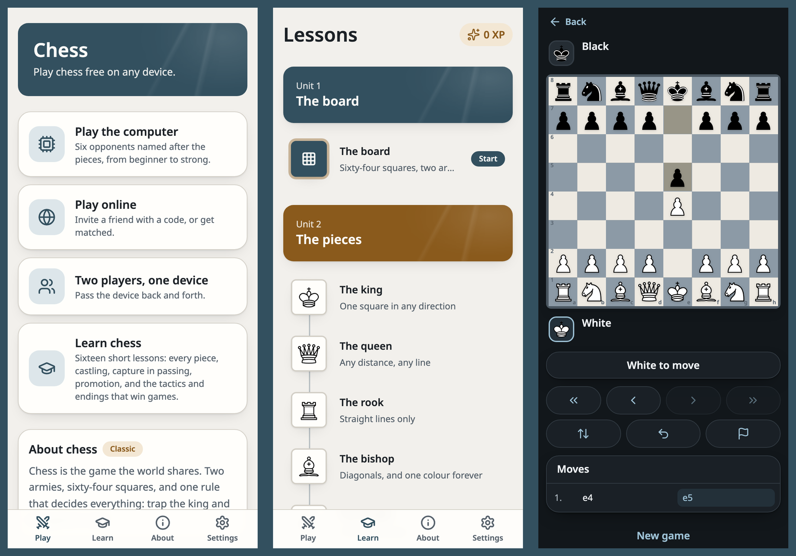
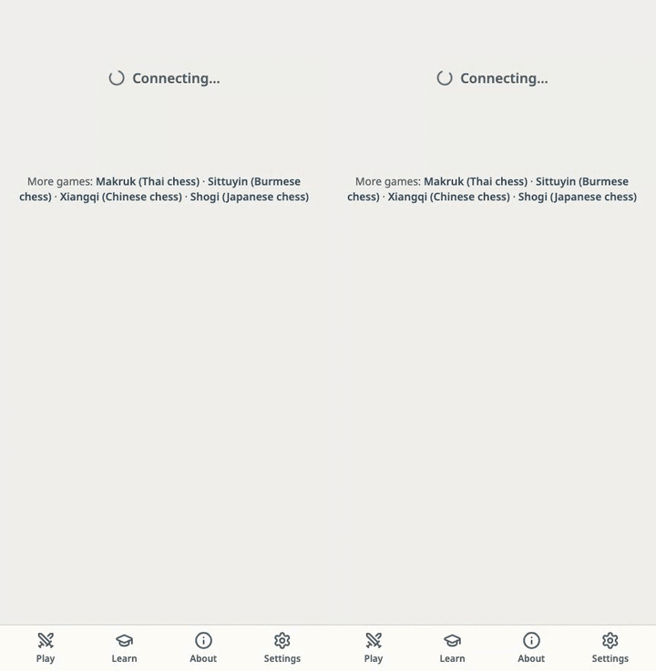
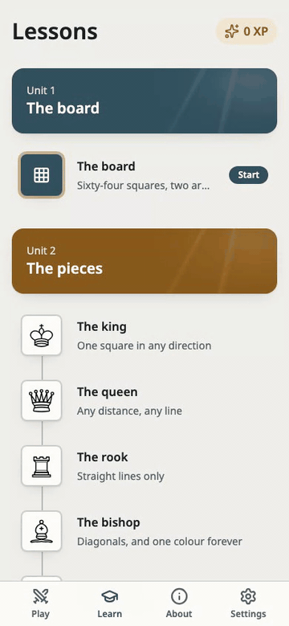
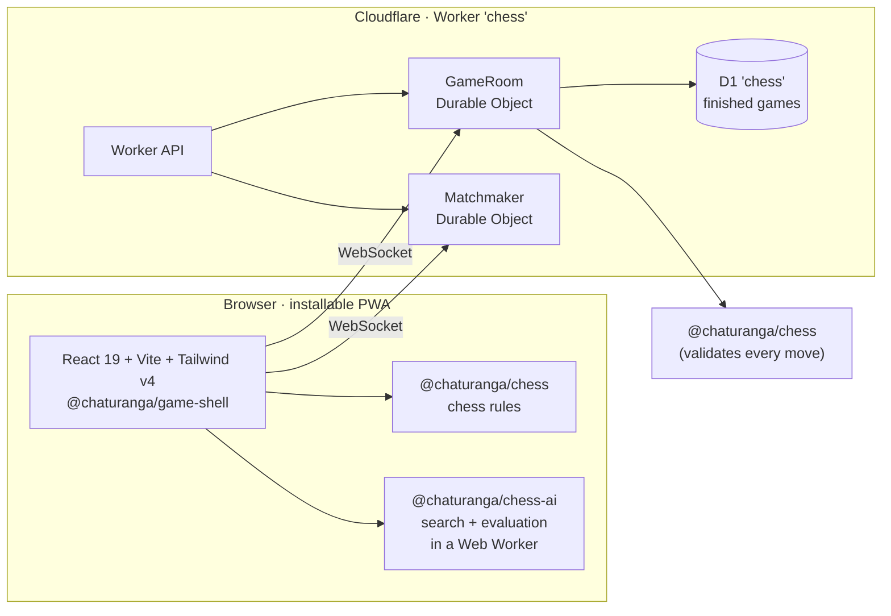

<div align="center">

**English** · Part of [Chaturanga](../../README.md)



# Chess

**Play chess online — free, no sign-up, on any device.**

[][play]

[](https://github.com/socheek-del/chaturanga/actions/workflows/ci.yml)
[](../../LICENSE)
[](../../CONTRIBUTING.md)
[][play]

[**Play**][play] · [Features](#features) · [What is chess?](#what-is-chess) · [Run it locally](#run-it-locally) · [Contribute](#contributing)

</div>

---

Chess is the game the world shares: two armies, sixty-four squares, and one rule that decides everything —
trap the king and it is over. This project brings it to any phone or computer: **learn the rules from
zero**, **practise against the computer**, and **play friends online** or on one device. No ads, no
accounts, and all the code is open source.

## Features

<table>
  <tr>
    <td width="50%" valign="top">
      <h3>🤖 Play the computer</h3>
      
      <p>Six opponents named after the pieces, from <b>Pawn</b> to <b>King</b>, each stronger than the last
      (checked by a ladder between every pair of levels). Ask for a hint or take a move back while you
      learn.</p>
    </td>
    <td width="50%" valign="top">
      <h3>🌐 Play friends online</h3>
      
      <p>Quick match at <b>3+2 · 5+0 · 10+0</b>, or create a room and share the code or link. The server
      checks every move with the same rules engine the browser uses, so castling, a capture in passing and
      a draw by repetition are judged the same on both sides.</p>
    </td>
  </tr>
  <tr>
    <td width="50%" valign="top">
      <h3>📚 Learn from zero</h3>
      
      <p>Sixteen short lessons: the board, every piece, castling, the capture in passing, promotion and
      under-promotion, check and checkmate, stalemate and the other draws, forks and pins, two endings to
      know, and how to start a game well. Every answer is checked by the rules engine, and every lesson is
      open — start wherever you like.</p>
    </td>
    <td width="50%" valign="top">
      <h3>🏛️ Its own look</h3>
      
      <p>"Marble": cool stone squares, slate blue for what you press and brass for what is worth noticing.
      Play with the <b>traditional</b> Staunton pieces you already know, or switch to the set drawn for this
      site. Three boards and a full dark mode.</p>
    </td>
  </tr>
</table>

- **Pass-and-play** on one device, with the board turned the right way for whoever is to move.
- **Real chess rules** — castling, the capture in passing, promotion to any of four pieces, stalemate,
  insufficient material, threefold repetition and the fifty-move rule — verified move-for-move against
  [Fairy-Stockfish](https://github.com/fairy-stockfish/Fairy-Stockfish), with the perft suite at full depth
  and the one deliberate divergence written down in [`RULES.md`](../../packages/chess/RULES.md).
- **Under-promotion is one tap**, because the site asks which piece instead of queening for you.
- **Chess clocks** with common presets, or no clock at all.
- **Works offline** once installed — lessons, pass-and-play and the computer need no connection.
- **Never lose a game to a refresh** — games are saved as you play.
- **No chat**, in any room, by design.

## What is chess?

Chess is played on eight ranks and eight files, by two armies of sixteen. White moves first.

| Piece | Moves |
|---|---|
| **King** | One square in any direction; he may never step into an attack |
| **Queen** | Any distance along a rank, a file or a diagonal |
| **Rook** | Any distance along a rank or a file |
| **Bishop** | Any distance along a diagonal, so it keeps one colour of square forever |
| **Knight** | Two squares in a line and one across, jumping over anything between |
| **Pawn** | One square forward (two from its own row), capturing one square diagonally |

Three moves surprise newcomers. **Castling**: the king steps two squares towards a rook and the rook jumps
over him, if neither has moved, the path is clear, and the king is not in, through or into check. **The
capture in passing**: a pawn that has just stepped two squares can be taken as if it had stepped one — but
only on the very next move. **Promotion**: a pawn that reaches the far row becomes a queen, rook, bishop or
knight, and choosing something other than the queen is sometimes the only way to win.

A game ends in checkmate, or in a draw: stalemate, too little material to mate, the same position three
times, or fifty moves with no capture and no pawn move. The in-app lessons and
[`RULES.md`](../../packages/chess/RULES.md) go through all of it.

## How it's built



| Package | What it does |
|---|---|
| [`packages/chess`](../../packages/chess) | Pure TypeScript rules engine — board, FEN, castling, capture in passing, promotion, the drawn endings, perft; cross-checked against Fairy-Stockfish |
| [`packages/chess-ai`](../../packages/chess-ai) | Six computer opponents on the shared [`ai-core`](../../packages/ai-core) search, with a real chess evaluation |
| [`packages/game-shell`](../../packages/game-shell) | The game screen, lesson player and online client shared by every Chaturanga site |
| [`packages/server-kit`](../../packages/server-kit) | Room logic and Durable Objects shared by every Chaturanga Worker |
| [`apps/chess/web`](web) | The React PWA: the board, lessons, pass-and-play, the computer and the online client |
| [`apps/chess/worker`](worker) | Cloudflare Worker with its own Durable Objects and D1 database |

Every push runs lint, type checks and unit tests (including the Worker inside `workerd`); the UI is covered
by Playwright end-to-end tests, and a bot ladder plays every pair of levels against each other.

## Run it locally

```bash
git clone https://github.com/socheek-del/chaturanga.git
cd chaturanga
nvm use            # Node 22
./init.sh          # install dependencies and run all checks
npm run dev:chess  # web on http://localhost:5178, API and online play on :8791
```

`npm run e2e -w apps/chess/web` runs the Playwright suite against a local web app and Worker, and
`npm run smoke:prod -w apps/chess/web` checks the live site. The public site address lives in one setting:
`apps/chess/web/site.config.ts`.

## Contributing

Contributions of every size are welcome — bug reports, rule corrections, new lessons, art and code. Start
with [**CONTRIBUTING.md**](../../CONTRIBUTING.md), or:

- 🐛 [Report a bug or suggest an idea](https://github.com/socheek-del/chaturanga/issues/new)
- ♟️ Know chess well? Check the lessons and [`RULES.md`](../../packages/chess/RULES.md)
- 🌍 Want the site in your language? That is the next open feature (`ch-011`)

## License

[GPL-3.0-or-later](../../LICENSE) © Chaturanga contributors. The "Marble" piece set was drawn for this
project and is covered by the same license. The default **traditional** set is by
[Cburnett](https://commons.wikimedia.org/wiki/Category:SVG_chess_pieces) on Wikimedia Commons, triple-licensed
GPLv2-or-later / BSD / CC BY-SA 3.0 and shipped here under the GPL; the files are stored verbatim with their
credits in [`web/src/features/board/pieces/traditional/CREDITS.md`](web/src/features/board/pieces/traditional/CREDITS.md).

<!-- The live site address is defined once here. -->
[play]: https://chess.beanroti.com
