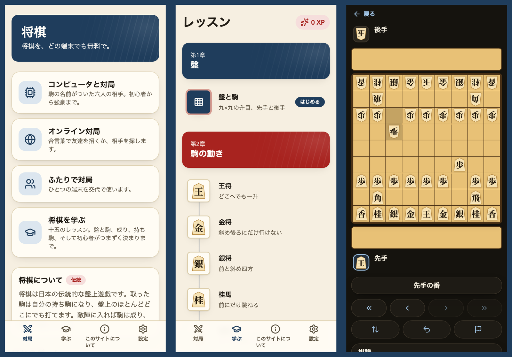
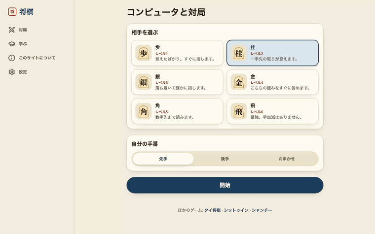
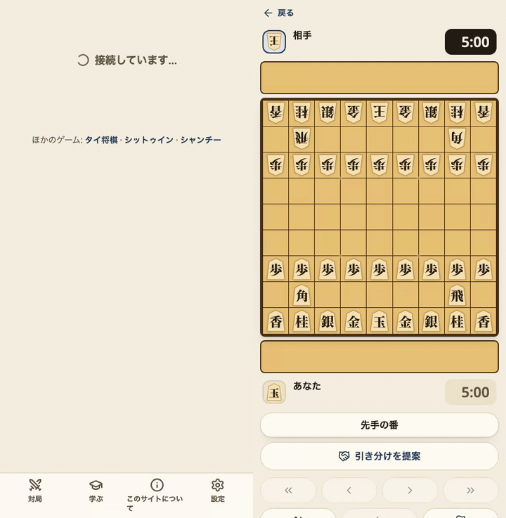
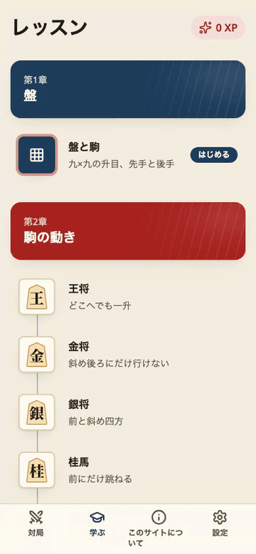
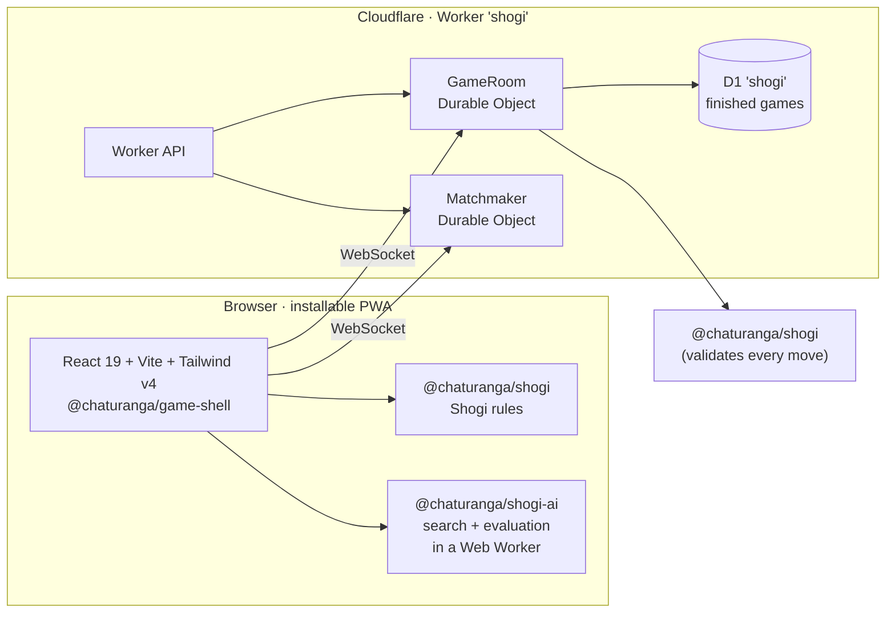

<div align="center">

**English** · [日本語](README.ja.md) · Part of [Chaturanga](../../README.md)



# 将棋 · Shogi

**Play Japanese chess online — free, no sign-up, in Japanese and English.**

[][play]

[](https://github.com/socheek-del/chaturanga/actions/workflows/ci.yml)
[](../../LICENSE)
[](../../CONTRIBUTING.md)
[][play]

[**Play**][play] · [Features](#features) · [What is Shogi?](#what-is-shogi) · [Run it locally](#run-it-locally) · [Contribute](#contributing)

</div>

---

Shogi (将棋) is the chess of Japan, and the one game in the chess family where **captured pieces come back**:
take a piece and it becomes yours, ready to be dropped almost anywhere on the board. Nothing is ever simply
traded off, and no attack is ever quite over. This project brings the game to any phone or computer —
**learn the rules from zero**, **practise against the computer**, and **play friends online** or on one
device. No ads, no accounts, and all the code is open source.

## Features

<table>
  <tr>
    <td width="50%" valign="top">
      <h3>🤖 Play the computer</h3>
      
      <p>Six opponents named after the pieces, from <b>歩 Fu</b> to <b>飛 Hisha</b>, each stronger than the
      last (checked by a ladder between every pair of levels). Ask for a hint or take a move back while you
      learn.</p>
    </td>
    <td width="50%" valign="top">
      <h3>🌐 Play friends online</h3>
      
      <p>Quick match at <b>3+2 · 5+0 · 10+0</b>, or create a room and share the code or link. The server
      checks every move — drops included — with the same rules engine the browser uses, so sennichite is
      judged the same on both sides.</p>
    </td>
  </tr>
  <tr>
    <td width="50%" valign="top">
      <h3>📚 Learn from zero</h3>
      
      <p>Fifteen short lessons: the board, every piece, promotion, dropping pieces from hand, the two things
      a dropped pawn may never do, check and checkmate, sennichite, and finishing a game. Every answer is
      checked by the rules engine, and every lesson is open — start wherever you like.</p>
    </td>
    <td width="50%" valign="top">
      <h3>🪵 Its own look</h3>
      
      <p>"Kaya" (榧): torreya wood and washi, indigo for what you press, and vermilion kept for one job — the
      face of a promoted piece. The kanji are drawn as outlines rather than font text, and there are three
      boards and a full dark mode.</p>
    </td>
  </tr>
</table>

- **Pass-and-play** on one device, with the board turned the right way for whoever is to move.
- **Real Shogi rules** — drops, optional and forced promotion, nifu, uchifuzume, sennichite and the
  perpetual-check exception — verified move-for-move against
  [Fairy-Stockfish](https://github.com/fairy-stockfish/Fairy-Stockfish), with the one place this engine
  deliberately differs written down in [`RULES.md`](../../packages/shogi/RULES.md).
- **Chess clocks** with common presets, or no clock at all.
- **Works offline** once installed — lessons, pass-and-play and the computer need no connection.
- **Never lose a game to a refresh** — games are saved as you play.
- **Japanese first, English too** — switch any time; the choice is remembered on your device.
- **No Japanese font download.** The piece kanji are SVG outlines, so the board costs bytes, not megabytes.

## What is Shogi?

Shogi is played on a board of nine squares by nine. Both players use the same pieces: a piece belongs to
whoever it points at, which is why a captured one can change sides. 先手 **Sente** moves first, 後手 **Gote**
second.

| Piece | Kanji | Moves | Promotes to |
|---|---|---|---|
| **King** | 王 / 玉 | One square in any direction | — |
| **Rook** | 飛 | Any distance along a rank or file | **Dragon** 龍: rook plus one diagonal step |
| **Bishop** | 角 | Any distance along a diagonal | **Horse** 馬: bishop plus one orthogonal step |
| **Gold** | 金 | One square, except diagonally backwards | — |
| **Silver** | 銀 | One square forward or diagonally | 全, moves as a Gold |
| **Knight** | 桂 | Two forward and one across, jumping over | 圭, moves as a Gold |
| **Lance** | 香 | Any distance straight forward | 杏, moves as a Gold |
| **Pawn** | 歩 | One square straight forward, and it takes that way too | と, moves as a Gold |

Three things surprise newcomers. **Drops**: instead of moving, you may place a captured piece back on the
board, which makes Shogi's endings sharper than any other chess. **Promotion is a choice** — in the last
three ranks a piece may turn over or stay as it is — except when it would have no move left, when it must
promote. And a dropped **pawn** is special: never two on the same file (二歩), and never one that delivers
checkmate (打ち歩詰め). The in-app lessons and [`RULES.md`](../../packages/shogi/RULES.md) explain it step by
step.

## How it's built



| Package | What it does |
|---|---|
| [`packages/shogi`](../../packages/shogi) | Pure TypeScript rules engine — the 9×9 board, hands and drops, promotion, nifu and uchifuzume, sennichite, FEN, perft; cross-checked against Fairy-Stockfish |
| [`packages/shogi-ai`](../../packages/shogi-ai) | Six computer opponents on the shared [`ai-core`](../../packages/ai-core) search, judging repetitions with the real rules |
| [`packages/game-shell`](../../packages/game-shell) | The game screen, lesson player and online client shared by every Chaturanga site |
| [`packages/server-kit`](../../packages/server-kit) | Room logic and Durable Objects shared by every Chaturanga Worker |
| [`apps/shogi/web`](web) | The React PWA: the board and piece stands, lessons, pass-and-play, the computer and the online client |
| [`apps/shogi/worker`](worker) | Cloudflare Worker with its own Durable Objects and D1 database |

Every push runs lint, type checks and unit tests (including the Worker inside `workerd`); the UI is covered by
Playwright end-to-end tests, and a GitHub Actions workflow plays a ladder between every pair of bot levels.

## Run it locally

```bash
git clone https://github.com/socheek-del/chaturanga.git
cd chaturanga
nvm use            # Node 22
./init.sh          # install dependencies and run all checks
npm run dev:shogi  # web on http://localhost:5177, API and online play on :8790
```

`npm run e2e -w apps/shogi/web` runs the Playwright suite against a local web app and Worker, and
`npm run smoke:prod -w apps/shogi/web` checks the live site. The public site address lives in one setting:
`apps/shogi/web/site.config.ts`.

## Contributing

Contributions of every size are welcome — bug reports, rule corrections, new lessons, translations, art and
code. Start with [**CONTRIBUTING.md**](../../CONTRIBUTING.md), or:

- 🐛 [Report a bug or suggest an idea](https://github.com/socheek-del/chaturanga/issues/new)
- 🇯🇵 Native Japanese speaker? Help review the wording with [`docs/i18n-review.md`](docs/i18n-review.md)
- ♟️ Know Shogi well? Check the lessons and [`RULES.md`](../../packages/shogi/RULES.md)

## License

[GPL-3.0-or-later](../../LICENSE) © Chaturanga contributors. The piece art was made for this project and is
covered by the same license. The piece kanji are outlines generated from
[Noto Serif JP](https://fonts.google.com/noto/specimen/Noto+Serif+JP) (SIL Open Font License 1.1; the licence
text is in [`web/src/features/board/OFL.txt`](web/src/features/board/OFL.txt)).

<!-- The live site address is defined once here. -->
[play]: https://jp-chess.beanroti.com
