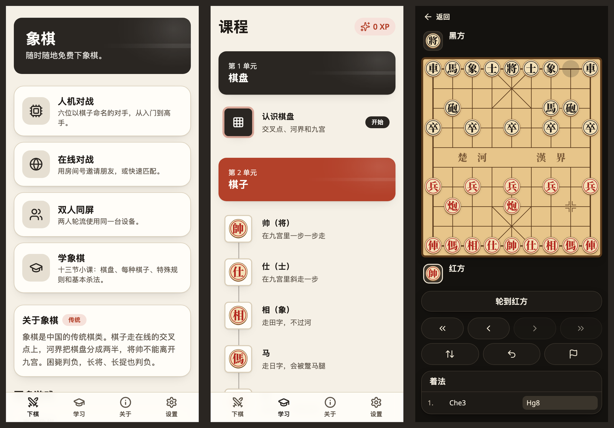
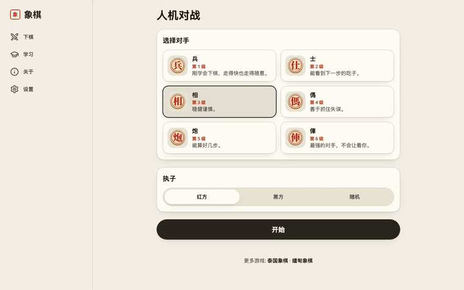
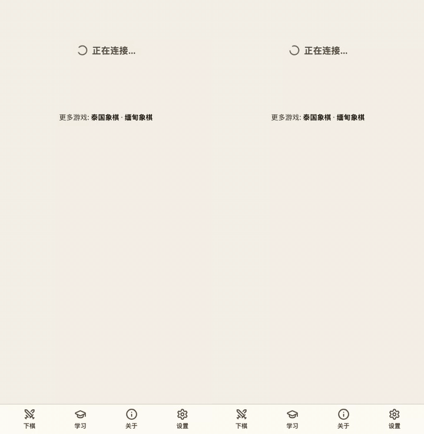
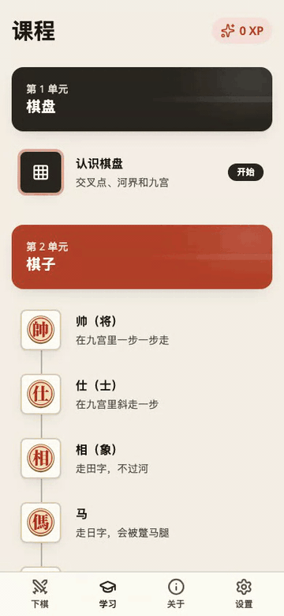
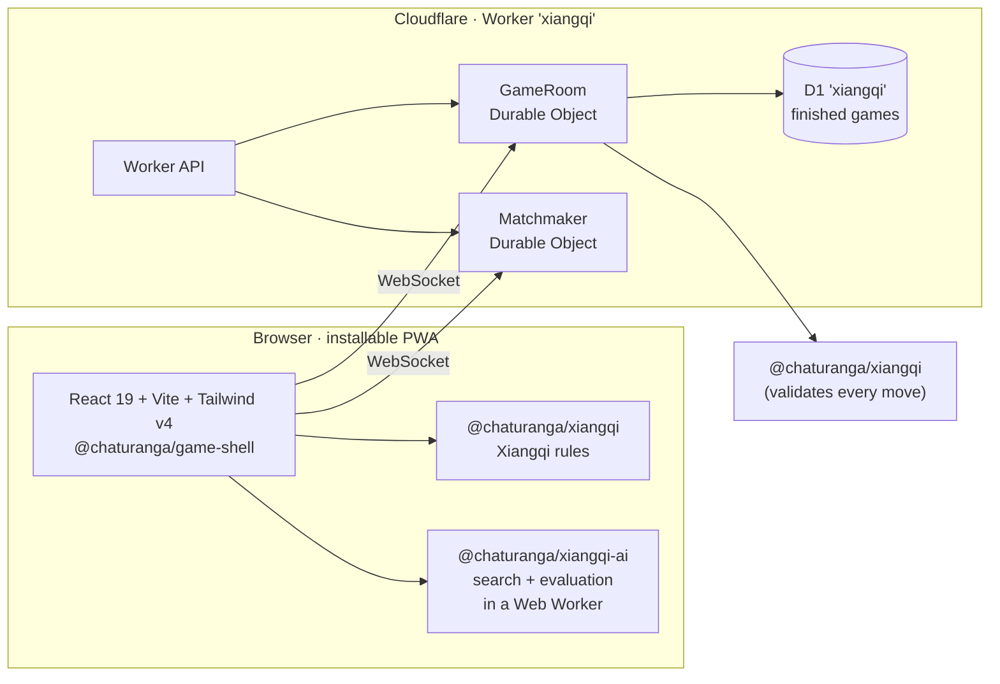

<div align="center">

**English** · [简体中文](README.zh-Hans.md) · Part of [Chaturanga](../../README.md)



# 象棋 · Xiangqi

**Play Chinese chess online — free, no sign-up, in Chinese and English.**

[][play]

[](https://github.com/socheek-del/chaturanga/actions/workflows/ci.yml)
[](../../LICENSE)
[](../../CONTRIBUTING.md)
[][play]

[**Play**][play] · [Features](#features) · [What is Xiangqi?](#what-is-xiangqi) · [Run it locally](#run-it-locally) · [Contribute](#contributing)

</div>

---

Xiangqi (象棋) is the traditional chess of China, and one of the most played board games in the world. The
pieces stand **on the intersections**, a river splits the board in two, and the General never leaves his
palace. This project brings the game to any phone or computer — **learn the rules from zero**, **practise
against the computer**, and **play friends online** or on one device. No ads, no accounts, and all the code is
open source.

## Features

<table>
  <tr>
    <td width="50%" valign="top">
      <h3>🤖 Play the computer</h3>
      
      <p>Six opponents named after the pieces, from <b>兵 Soldier</b> to <b>俥 Chariot</b>, each stronger than
      the last (checked by a 20-game ladder on every level). Ask for a hint or take a move back while you
      learn.</p>
    </td>
    <td width="50%" valign="top">
      <h3>🌐 Play friends online</h3>
      
      <p>Quick match at <b>3+2 · 5+0 · 10+0</b>, or create a room and share the code or link. The server
      checks every move with the same rules engine the browser uses, so a perpetual check is judged the same
      on both sides.</p>
    </td>
  </tr>
  <tr>
    <td width="50%" valign="top">
      <h3>📚 Learn from zero</h3>
      
      <p>Thirteen short lessons: the board and its river, every piece, the flying general, check and
      checkmate, stalemate, and the basic mates. Every answer is checked by the rules engine, and every
      lesson is open — start wherever you like.</p>
    </td>
    <td width="50%" valign="top">
      <h3>🖋️ Its own look</h3>
      
      <p>"Mo" (墨, ink): ink black and seal vermilion on xuan paper, carved-disc pieces whose characters are
      drawn as outlines rather than font text, three boards (maple, xuan paper, ink night) and a full dark
      mode.</p>
    </td>
  </tr>
</table>

- **Pass-and-play** on one device, turning the board between moves.
- **Real Xiangqi rules** — the palace, the river, the hobbled horse, the blocked elephant, the flying
  general, and the repetition rules for perpetual check and perpetual chase — verified move-for-move against
  [Fairy-Stockfish](https://github.com/fairy-stockfish/Fairy-Stockfish).
- **Stalemate loses**, as it should in Xiangqi, and the game says so.
- **Chess clocks** with common presets, or no clock at all.
- **Works offline** once installed — lessons, pass-and-play and the computer need no connection.
- **Never lose a game to a refresh** — games are saved as you play.
- **Chinese first, English too** — switch any time; the choice is remembered on your device.
- **No CJK font download.** The piece characters are SVG outlines, so the board costs bytes, not megabytes.

## What is Xiangqi?

Xiangqi is played on a board of 9 files and 10 ranks, with the pieces on the **intersections**, not in the
squares. Across the middle runs the **river** (楚河 漢界), and at each end is a three-by-three **palace**
marked with a cross. Red moves first.

| Piece | Red / Black | Moves | Closest chess piece |
|---|---|---|---|
| **General** | 帥 / 將 | One point along a line, never leaving the palace | King |
| **Advisor** | 仕 / 士 | One point diagonally, never leaving the palace | (much weaker Queen) |
| **Elephant** | 相 / 象 | Two points diagonally, never across the river, blocked by a piece in between | (Bishop's step) |
| **Horse** | 傌 / 馬 | One point straight then one diagonally, blocked by a piece beside it | Knight |
| **Chariot** | 俥 / 車 | Any distance along a line | Rook |
| **Cannon** | 炮 / 砲 | Moves like a Chariot, but captures only by jumping exactly one piece | — |
| **Soldier** | 兵 / 卒 | One point forward; once across the river, also sideways | Pawn |

Two rules surprise newcomers. The **flying general**: the two Generals may never face each other down an open
file, so a piece may be pinned by the enemy General alone. And **stalemate loses** — a player with no legal
move is defeated, not saved. Repetition is not simply a draw either: endlessly checking (perpetual check) or
endlessly chasing an unprotected piece loses the game. The in-app lessons and
[`RULES.md`](../../packages/xiangqi/RULES.md) explain it step by step.

## How it's built



| Package | What it does |
|---|---|
| [`packages/xiangqi`](../../packages/xiangqi) | Pure TypeScript rules engine — the 9×10 point board, the palace and river, chasing and perpetual-check rules, FEN, perft; cross-checked against Fairy-Stockfish |
| [`packages/xiangqi-ai`](../../packages/xiangqi-ai) | Six computer opponents on the shared [`ai-core`](../../packages/ai-core) search, judging repetitions with the real rules |
| [`packages/game-shell`](../../packages/game-shell) | The game screen, lesson player and online client shared by every Chaturanga site |
| [`packages/server-kit`](../../packages/server-kit) | Room logic and Durable Objects shared by every Chaturanga Worker |
| [`apps/xiangqi/web`](web) | The React PWA: the point board, lessons, pass-and-play, the computer and the online client |
| [`apps/xiangqi/worker`](worker) | Cloudflare Worker with its own Durable Objects and D1 database |

Every push runs lint, type checks and unit tests (including the Worker inside `workerd`); the UI is covered by
Playwright end-to-end tests, and a GitHub Actions workflow plays a 20-game ladder between every pair of bot
levels.

## Run it locally

```bash
git clone https://github.com/socheek-del/chaturanga.git
cd chaturanga
nvm use            # Node 22
./init.sh          # install dependencies and run all checks
npm run dev:xiangqi   # web on http://localhost:5176, API and online play on :8789
```

`npm run e2e -w apps/xiangqi/web` runs the Playwright suite against a local web app and Worker, and
`npm run smoke:prod -w apps/xiangqi/web` checks the live site. The public site address lives in one setting:
`apps/xiangqi/web/site.config.ts`.

## Contributing

Contributions of every size are welcome — bug reports, rule corrections, new lessons, translations, art and
code. Start with [**CONTRIBUTING.md**](../../CONTRIBUTING.md), or:

- 🐛 [Report a bug or suggest an idea](https://github.com/socheek-del/chaturanga/issues/new)
- 🇨🇳 Native Chinese speaker? Help review the wording with [`docs/i18n-review.md`](docs/i18n-review.md)
- ♟️ Know Xiangqi well? Check the lessons and [`RULES.md`](../../packages/xiangqi/RULES.md)

## License

[GPL-3.0-or-later](../../LICENSE) © Chaturanga contributors. The piece art and illustrations were made for this
project and are covered by the same license. The piece characters are outlines generated from
[Noto Serif TC](https://fonts.google.com/noto/specimen/Noto+Serif+TC) (SIL Open Font License 1.1; the licence
text is in [`web/src/features/board/OFL.txt`](web/src/features/board/OFL.txt)).

<!-- The live site address is defined once here. -->
[play]: https://cn-chess.beanroti.com
