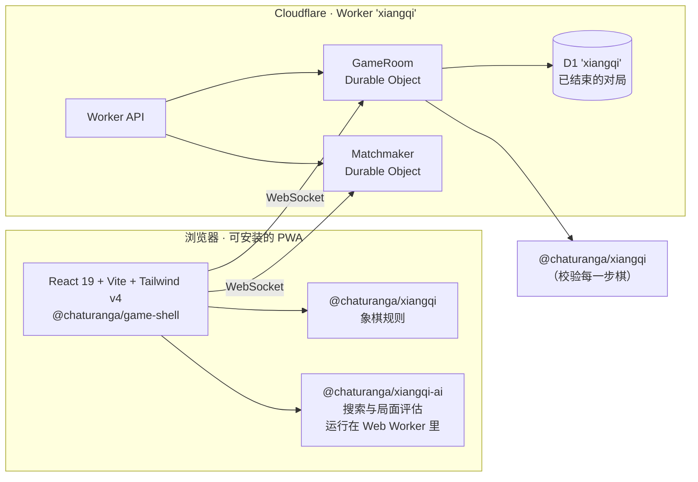

<div align="center">

[English](README.md) · **简体中文** · [Chaturanga](../../README.md) 项目的一部分


# 象棋 · Xiangqi

**在线下象棋——免费、免注册，支持中文和英文。**

[][play]

[](https://github.com/socheek-del/chaturanga/actions/workflows/ci.yml)
[](../../LICENSE)
[](../../CONTRIBUTING.md)
[][play]

[**开始下棋**][play] · [功能](#功能) · [象棋是什么](#象棋是什么) · [本地运行](#本地运行) · [参与贡献](#参与贡献)

</div>

---

象棋是中国的传统棋类，也是世界上下的人最多的棋之一。棋子走在**交叉点**上，河界把棋盘分成两半，将帅不能离开
九宫。这个项目把象棋带到任何手机和电脑上——**从零学规则**、**和电脑对弈**、**和朋友在线对战**或在同一台设备上
轮流下。没有广告，不用注册，所有代码开源。

## 功能

<table>
  <tr>
    <td width="50%" valign="top">
      <h3>🤖 人机对战</h3>
      
      <p>六位以棋子命名的对手，从 <b>兵</b> 到 <b>俥</b>，一位强过一位（每一级都用 20 局的阶梯赛验证过）。
      学棋时可以要提示，也可以悔棋。</p>
    </td>
    <td width="50%" valign="top">
      <h3>🌐 在线对战</h3>
      
      <p><b>3+2 · 5+0 · 10+0</b> 快速匹配，或者创建房间，把房间号或链接发给朋友。服务器用和浏览器同一套
      规则引擎校验每一步棋，所以长将的判罚两边完全一致。</p>
    </td>
  </tr>
  <tr>
    <td width="50%" valign="top">
      <h3>📚 从零学起</h3>
      
      <p>十三节小课：棋盘和河界、每种棋子、白脸将、将军和绝杀、困毙，以及基本杀法。每个答案都由规则引擎
      判定，而且所有课程都是开放的——想从哪节开始都行。</p>
    </td>
    <td width="50%" valign="top">
      <h3>🖋️ 自己的样子</h3>
      
      <p>“墨”：宣纸底色上的墨黑与印章朱红，刻盘式棋子，棋子上的字是轮廓图形而不是字体文字，三种棋盘
      （枫木、宣纸、墨夜），并有完整的深色模式。</p>
    </td>
  </tr>
</table>

- **双人同屏**：两人轮流使用同一台设备。
- **真正的象棋规则**——九宫、河界、蹩马腿、塞象眼、白脸将，以及长将和长捉的重复局面规则——与
  [Fairy-Stockfish](https://github.com/fairy-stockfish/Fairy-Stockfish) 逐步核对过。
- **困毙判负**，符合象棋规则，而且对局结束时会说明原因。
- **棋钟**：常用时限可选，也可以不用棋钟。
- **安装后可离线使用**——课程、双人同屏和人机对战都不需要联网。
- **刷新页面也不会丢棋局**——对局随下随存。
- **中文为主，也支持英文**——随时切换，选择会记在本机。
- **不下载中文字体**：棋子上的字是 SVG 轮廓，棋盘只占几十 KB，而不是几 MB。

## 象棋是什么

象棋在 9 路 10 线的棋盘上下，棋子走在**交叉点**上，而不是格子里。棋盘中间是**河界**（楚河 漢界），两端各有
一个三乘三、画着斜叉的**九宫**。红先。

| 棋子 | 红 / 黑 | 走法 | 最接近的国际象棋棋子 |
|---|---|---|---|
| **将帅** | 帥 / 將 | 沿线走一步，不出九宫 | 王 |
| **士** | 仕 / 士 | 沿九宫斜线走一步，不出九宫 | （弱得多的后） |
| **象** | 相 / 象 | 走田字，不过河，象眼被塞则不能走 | （象的斜步） |
| **马** | 傌 / 馬 | 走日字，蹩马腿则不能走 | 马 |
| **车** | 俥 / 車 | 沿线走任意步数 | 车 |
| **炮** | 炮 / 砲 | 走法同车，吃子必须隔一个棋子 | — |
| **兵卒** | 兵 / 卒 | 向前一步；过河后还可以横走 | 兵 |

有两条规则最容易让新手意外。**白脸将**：两个将帅不能在同一条直线上相互照面，所以一个棋子可能只被对方的将
牵制住。还有**困毙判负**——无棋可走的一方算输，而不是和棋。重复局面也不是一律和棋：长将和长捉未受保护的子
都判负。应用内的课程和 [`RULES.md`](../../packages/xiangqi/RULES.md) 有逐条说明。

## 技术架构



| 包 | 作用 |
|---|---|
| [`packages/xiangqi`](../../packages/xiangqi) | 纯 TypeScript 规则引擎——9×10 交叉点棋盘、九宫与河界、长捉与长将规则、FEN、perft；与 Fairy-Stockfish 交叉验证 |
| [`packages/xiangqi-ai`](../../packages/xiangqi-ai) | 六位电脑对手，基于共用的 [`ai-core`](../../packages/ai-core) 搜索，并用真实规则判定重复局面 |
| [`packages/game-shell`](../../packages/game-shell) | 各站点共用的对局界面、课程播放器和在线客户端 |
| [`packages/server-kit`](../../packages/server-kit) | 各站点 Worker 共用的房间逻辑和 Durable Objects |
| [`apps/xiangqi/web`](web) | React PWA：交叉点棋盘、课程、双人同屏、人机对战和在线对战 |
| [`apps/xiangqi/worker`](worker) | Cloudflare Worker，拥有自己的 Durable Objects 和 D1 数据库 |

每次推送都会运行 lint、类型检查和单元测试（包括在 `workerd` 里运行的 Worker 测试）；界面由 Playwright
端到端测试覆盖，另有一个 GitHub Actions 工作流在相邻等级之间各下 20 局阶梯赛。

## 本地运行

```bash
git clone https://github.com/socheek-del/chaturanga.git
cd chaturanga
nvm use            # Node 22
./init.sh          # 安装依赖并运行全部检查
npm run dev:xiangqi   # 网页在 http://localhost:5176，接口和在线对战在 :8789
```

`npm run e2e -w apps/xiangqi/web` 针对本地网页和 Worker 运行 Playwright 测试，
`npm run smoke:prod -w apps/xiangqi/web` 检查线上站点。站点地址只写在一个设置里：
`apps/xiangqi/web/site.config.ts`。

## 参与贡献

欢迎各种大小的贡献——报告问题、纠正规则、新增课程、翻译、美术和代码。请先看
[**CONTRIBUTING.md**](../../CONTRIBUTING.md)，或者：

- 🐛 [报告问题或提出建议](https://github.com/socheek-del/chaturanga/issues/new)
- 🇨🇳 母语是中文？欢迎用 [`docs/i18n-review.md`](docs/i18n-review.md) 帮忙校对措辞
- ♟️ 熟悉象棋？欢迎检查课程内容和 [`RULES.md`](../../packages/xiangqi/RULES.md)

## 许可

[GPL-3.0-or-later](../../LICENSE) © Chaturanga contributors。棋子美术和插图为本项目原创，适用同一许可。
棋子上的字是由 [Noto Serif TC](https://fonts.google.com/noto/specimen/Noto+Serif+TC) 生成的轮廓
（SIL Open Font License 1.1，许可文本见
[`web/src/features/board/OFL.txt`](web/src/features/board/OFL.txt)）。

<!-- 线上站点地址只在这里定义一次。 -->
[play]: https://cn-chess.beanroti.com
